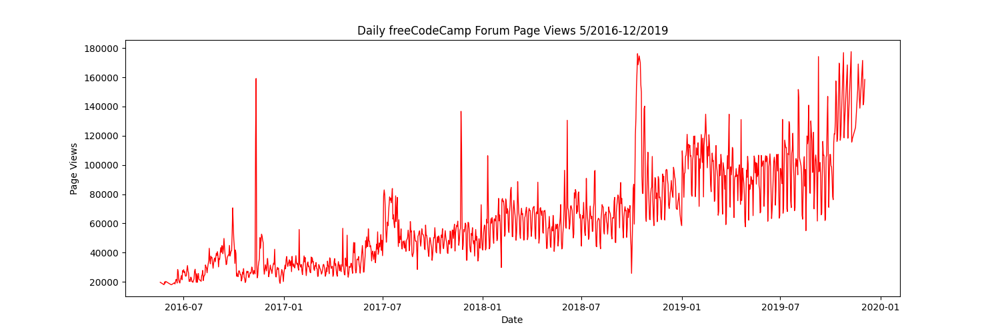
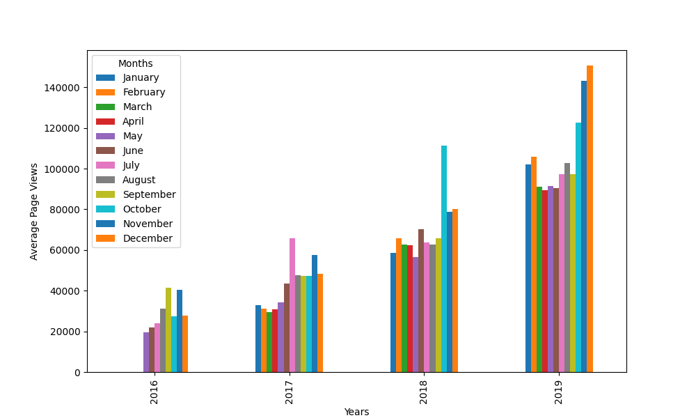
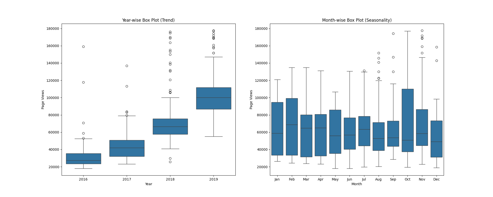

# Page View Time Series Visualizer

This is the boilerplate for the Page View Time Series Visualizer project. Instructions for building your project can be found at https://www.freecodecamp.org/learn/data-analysis-with-python/data-analysis-with-python-projects/page-view-time-series-visualizer

## 1. Gráfico de Linha: Visualizações Diárias
Mostra a tendência geral das visualizações de página ao longo do tempo.

## 2. Gráfico de Barras: Média de Visualizações por Mês
Compara a média de visualizações de página para cada mês, agrupado por ano, mostrando padrões sazonais e de crescimento.

## 3. Box Plots: Distribuição Anual e Mensal
O primeiro gráfico mostra a distribuição das visualizações por ano (tendência), e o segundo mostra a distribuição por mês (sazonalidade).

